# Predicting Patient Survival in Heart Failure with Azure Machine Learning

In this project, the usage of the Azure ML Python SDK is demonstrated for training a model to predict mortality due to heart failure using Azure AutoML and Hyperdrive services. Following training, the deployment of the best model will be performed, and the model endpoint will be evaluated through consumption.

The predictive model trained and deployed in this project has the potential to impact clinical practice, as it becomes a new supporting tool for physicians in assessing the increased risk of mortality among heart failure patients.

Below is a visualization illustrating the rough overview of the operations conducted in this project:
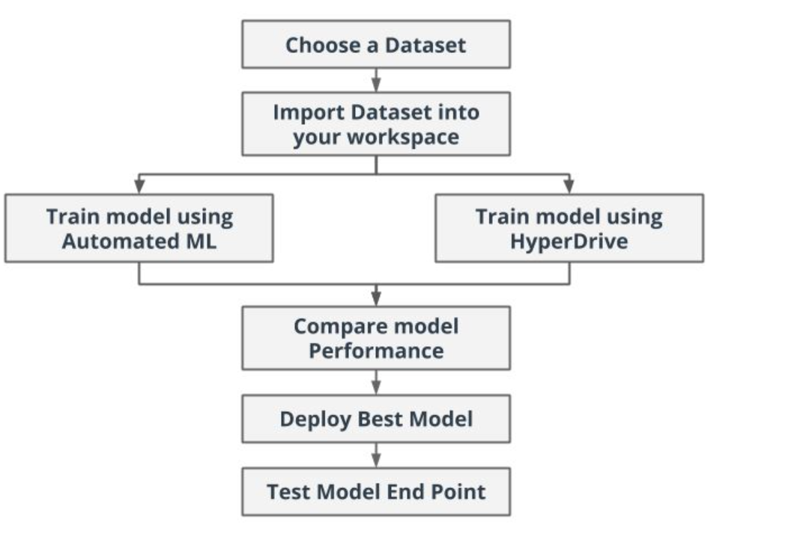


## Project Set Up and Installation

To execute the project in Azure Machine Learning Studio, the following components are required:

1. Create an Azure ML workspace with a compute instance.
2. Within the workspace, create an Azure ML compute cluster.
3. Register the `heart_failure_clinical_records_dataset.csv` dataset to Azure ML Studio from this repository.
4. Import the following notebooks and scripts provided in this repository to the Notebooks section in Azure ML Studio:
   - `automl.ipynb`: for conducting the AutoML experiment.
   - `hyperparameter_tuning.ipynb`: for executing the HyperDrive experiment.
   - `train.py`: a fundamental script for data manipulation used in the HyperDrive experiment.
   - `score.py`: the script employed for deploying the model, downloadable from within Azure Machine Learning Studio.
   - `env.yml`: the environment file, also downloadable from within Azure Machine Learning Studio.

All instructions for running the cells are detailed within the notebooks.

## Dataset

### Overview
The [Heart Failure Prediction dataset](https://raw.githubusercontent.com/robiulrafi/Azure-ML-Engineer-Nanodegree-Project-Portfolio/main/Optimizing%20an%20ML%20Pipeline%20in%20Azure/heart_failure_clinical_records_dataset.csv) serves to evaluate the severity of heart failure in patients. It comprises medical records from 299 heart failure patients gathered at the Faisalabad Institute of Cardiology and the Allied Hospital in Faisalabad (Punjab, Pakistan) between April and December 2015. The patients, aged 40 years and older, consist of 105 women and 194 men who have all previously experienced heart failure.

This dataset includes 13 features, documenting clinical, physiological, and lifestyle details, and serves as the training data for predicting heart failure risks. Notably, the dataset exhibits an imbalance, with 203 patients surviving (death event = 0) and 96 patients deceased (death event = 1).
Further details about this dataset can be found in the [original publication](https://bmcmedinformdecismak.biomedcentral.com/articles/10.1186/s12911-020-1023-5)_ by the dataset curators.

### Task
The task at hand involves predicting mortality due to heart failure, a common event often caused by Cardiovascular diseases (CVDs). Heart failure occurs when the heart cannot pump enough blood to meet the body's needs, with diabetes, high blood pressure, and other heart conditions among the main contributing factors. By employing machine learning procedures in this analysis, we aim to develop a predictive model that assesses the severity of heart failure in patients.

The objective is to train a binary classification model to predict the target column DEATH_EVENT, indicating whether a heart failure patient will survive or not before the end of the follow-up period. This prediction relies on 13 clinical features (or risk factors), including:

1. Age: the patient's age (years)
2. Anaemia: a binary indicator of decreased red blood cells or hemoglobin (1 for present, 0 for absent)
3. Creatinine Phosphokinase: the level of the CPK enzyme in the blood (mcg/L)
4. Diabetes: a binary indicator of diabetes presence (1 for present, 0 for absent)
5. Ejection Fraction: the percentage of blood leaving the heart at each contraction (percentage)
6. High Blood Pressure: a binary indicator of hypertension presence (1 for present, 0 for absent)
7. Platelets: the platelet count in the blood (kiloplatelets/mL)
8. Serum Creatinine: the level of serum creatinine in the blood (mg/dL)
9. Serum Sodium: the level of serum sodium in the blood (mEq/L)
10. Sex: the patient's gender (binary, with values for woman or man)
11. Smoking: a binary indicator of smoking status (1 for smoker, 0 for non-smoker)
12. Time: the follow-up period (days)

The target variable, DEATH_EVENT, is binary, with 1 indicating deceased patients and 0 indicating survived patients. The primary objective of this project is to classify patients based on their odds of survival using these 13 features. The classification result is reflected in the last column named Death Event (target), with values of either 0 (indicating survival) or 1 (indicating mortality).

### Access

The data for this project is accessed through the following steps in our workspace:

The data is uploaded to this [GitHub repository](https://raw.githubusercontent.com/robiulrafi/Azure-ML-Engineer-Nanodegree-Project-Portfolio/main/Optimizing%20an%20ML%20Pipeline%20in%20Azure/heart_failure_clinical_records_dataset.csv).

The dataset is registered using either the AzureML SDK or AzureML Studio, utilizing a web URL or local files.

For this particular project, the dataset is registered in our workspace using a web URL with Azure SDK. 
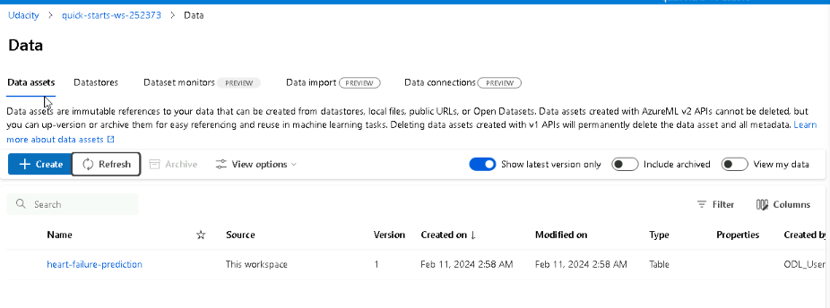

Subsequently, the data is retrieved from the CSV file employing the TabularDatasetFactory Class.


## Automated ML

The following Automated ML settings and configuration is chosen:

```python

# Parameters for AutoML Settings

automl_settings = {"n_cross_validations": 2,
                    "primary_metric": 'accuracy',
                    "enable_early_stopping": True,
                    "max_concurrent_iterations": 4,
                    "experiment_timeout_minutes": 20,
                    "verbosity": logging.INFO
                    }

# Parameters for AutoMLConfig

automl_config = AutoMLConfig(compute_target = compute_target,
                            task='classification',
                            training_data=dataset,
                            label_column_name='DEATH_EVENT',
                            featurization= 'auto',
                            debug_log = "automl_errors.log",
                            **automl_settings
                            )
```

1. `n_cross_validations`: 2
   - This parameter specifies the number of cross-validation folds to be used during training. Cross-validation is a technique used to assess the model's performance and generalization ability. A smaller number of folds (like 2 in this case) might be chosen for faster training, especially when computational resources or time are limited.

2. `primary_metric`: 'accuracy'
   - The primary metric determines what aspect of the model's performance to optimize during training. 'Accuracy' is a common metric for classification tasks, as it represents the proportion of correctly predicted instances out of the total instances. Maximizing accuracy ensures that the model makes accurate predictions overall.

3. `enable_early_stopping`: True
   - Enabling early stopping allows the training process to terminate if the performance metric stops improving. This helps prevent overfitting and saves computational resources by stopping training early if the model's performance has plateaued.

4. `max_concurrent_iterations`: 4
   - This parameter specifies the maximum number of parallel iterations or concurrent training jobs to execute. Setting it to 4 allows for multiple training iterations to be executed simultaneously, leveraging available computational resources efficiently and potentially reducing the overall training time.

5. `experiment_timeout_minutes`: 20
   - Sets the maximum amount of time, in minutes, allowed for the experiment to run. A value of 20 minutes ensures that the experiment doesn't run indefinitely and provides a time constraint for model training. This helps prevent excessive resource consumption and ensures timely completion of the experiment.

6. `verbosity`: logging.INFO
   - Controls the amount of logging information displayed during the training process. Setting it to `logging.INFO` ensures that informational messages are logged, providing insights into the training progress without overwhelming the output with excessive details.

The AutoMLConfig parameters are as follows:

1. `compute_target`:
   - Specifies the compute target where the training will be executed.

2. `task`:
   - Defines the type of task, in this case, 'classification' since we're dealing with a binary classification problem.

3. `training_data`:
   - Indicates the dataset to be used for training the model.

4. `label_column_name`:
   - Specifies the name of the target column ('DEATH_EVENT') that the model will predict.

5. `featurization`:
   - Controls the featurization process. Setting it to 'auto' allows AutoML to automatically handle feature engineering.

6. `debug_log`:
   - Specifies the file path to store debug logs generated during the training process.

7. `**automl_settings`:
   - Additional settings for the AutoML experiment, such as the number of cross-validations, primary metric, early stopping, maximum concurrent iterations, experiment timeout, and verbosity level. These settings are passed as keyword arguments to the AutoMLConfig.


### Results
Voting Ensemble provides the best accuracy of 0.8628. These parameters are used in terms of training and predicting the ensemble classifiers. 
``` python   
run_algorithm': 'VotingEnsemble',
'ensembled_iterations': '[21, 33, 5, 26, 31, 11, 25, 6, 12]',
'ensembled_algorithms': "['XGBoostClassifier', 'LightGBM', 'LightGBM', 'RandomForest', 'RandomForest', 'RandomForest', 'LightGBM', 'LogisticRegression', 'LogisticRegression']",
'ensembled_run_ids': "['AutoML_14165718-5495-4815-b083-0313873ebed2_21', 'AutoML_14165718-5495-4815-b083-0313873ebed2_33', 'AutoML_14165718-5495-4815-b083-0313873ebed2_5', 'AutoML_14165718-5495-4815-b083-0313873ebed2_26', 'AutoML_14165718-5495-4815-b083-0313873ebed2_31', 'AutoML_14165718-5495-4815-b083-0313873ebed2_11', 'AutoML_14165718-5495-4815-b083-0313873ebed2_25', 'AutoML_14165718-5495-4815-b083-0313873ebed2_6', 'AutoML_14165718-5495-4815-b083-0313873ebed2_12']",
'ensemble_weights': '[0.25, 0.08333333333333333, 0.08333333333333333, 0.08333333333333333, 0.08333333333333333, 0.08333333333333333, 0.16666666666666666, 0.08333333333333333, 0.08333333333333333]
```
**Improvements for AutoML**:

1. Extend the experiment timeout to provide ample time for thorough model experimentation and optimization. A longer duration allows AutoML to explore a wider range of model architectures, hyperparameters, and feature transformations, leading to potentially better-performing models.

2. Conduct feature selection or removal to eliminate collinear features or those deemed unimportant in making prediction decisions. Collinear features can introduce multicollinearity issues, while irrelevant features may add noise to the model or increase its complexity unnecessarily. By refining the feature set to include only the most informative variables, we can enhance the model's performance, interpretability, and generalization ability.
   
 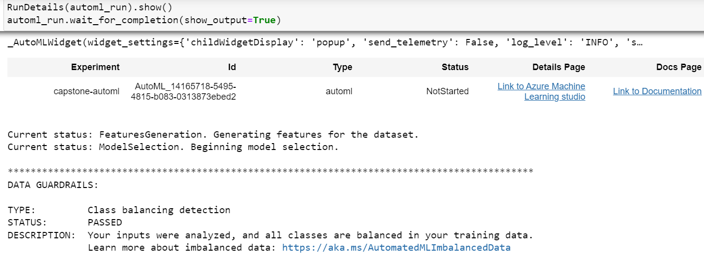
 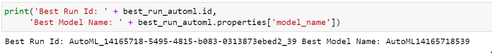
 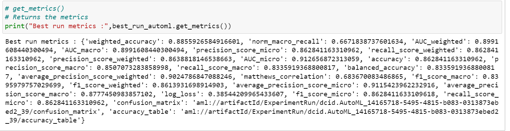
 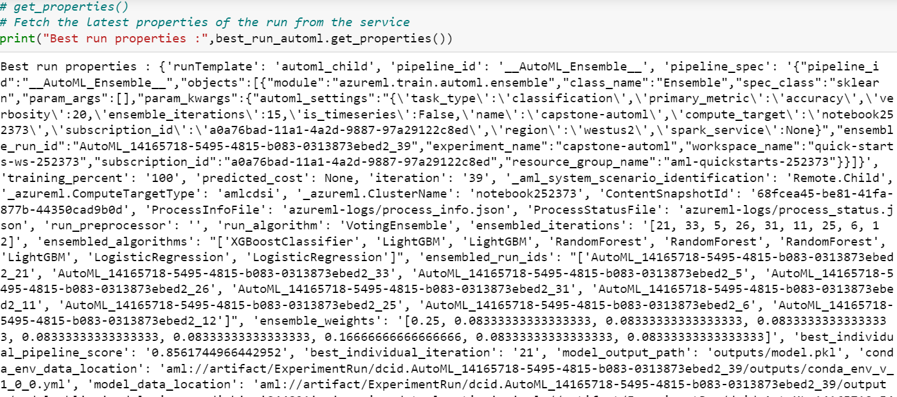
 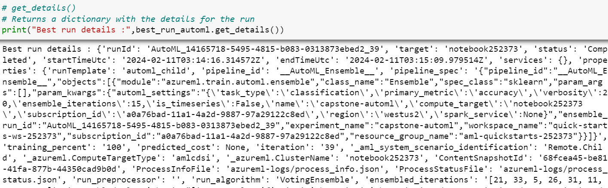
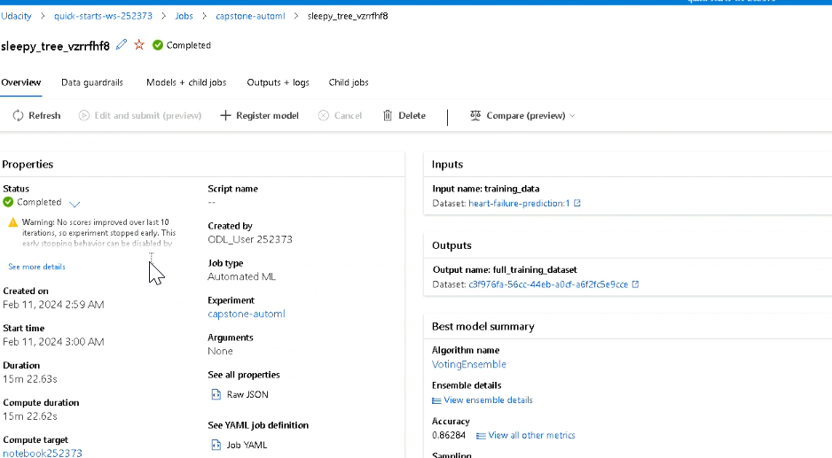
 

## Hyperparameter Tuning

The following configuration is chosen for the hyperparameter tuning experiment:

```python
early_termination_policy = BanditPolicy(evaluation_interval=2, delay_evaluation=5, slack_factor=0.1)

param_sampling = RandomParameterSampling(
    {
        '--C' : choice(0.001,0.01,0.1,1,10,20,50,100,200,500,1000),
        '--max_iter': choice(50,100,200,300)
    }
)


env = Environment.from_pip_requirements(name='venv', file_path='./requirements.txt')

estimator = ScriptRunConfig(
    source_directory=".",
    script='train.py',
    compute_target=compute_target,
    environment=env
    )
               
hyperdrive_run_config = HyperDriveConfig(
                            run_config=estimator,
                            hyperparameter_sampling=param_sampling,
                            policy=early_termination_policy,
                            primary_metric_name='Accuracy',
                            primary_metric_goal=PrimaryMetricGoal.MAXIMIZE,
                            max_total_runs=16,
                            max_concurrent_runs=4
                            )
```
1. **Early Termination Policy**:
   - `BanditPolicy` is chosen as the early termination policy. It automatically terminates poorly performing runs based on slack criteria, making it suitable for resource-efficient experimentation.
   - `evaluation_interval`: Specifies the frequency for applying the policy. In this case, every 2 iterations (or runs) will be evaluated.
   - `delay_evaluation`: Sets the delay for the first policy evaluation. This allows sufficient runs to be completed before applying the early termination policy.
   - `slack_factor`: Defines the slack allowed concerning the best-performing run. If a run's performance falls below this slack factor compared to the best run, it will be terminated early.

2. **Parameter Sampling**:
   - `RandomParameterSampling` is used for hyperparameter sampling. It randomly selects parameter values from the specified search space, allowing for comprehensive exploration of hyperparameters.
   - For `--C`, a choice of values ranging from 0.001 to 1000 is provided.
   - For `--max_iter`, several discrete values are provided, ranging from 50 to 300.

3. **Estimator and HyperDrive Config**:
   - An environment (`env`) is created from pip requirements specified in the `requirements.txt` file. This ensures consistent dependencies across experiments.
   - `ScriptRunConfig` defines the configuration for running a script (`train.py`) on the specified compute target (`compute_target`). The environment (`env`) is also specified to ensure reproducibility.
   
4. **HyperDriveConfig**:
   - `HyperDriveConfig` encapsulates the configuration for HyperDrive, Microsoft Azure's hyperparameter tuning service.
   - `run_config`: Specifies the configuration for running the script, including the source directory, script file, compute target, and environment.
   - `hyperparameter_sampling`: Specifies the hyperparameter sampling method, which is set to `param_sampling`.
   - `policy`: Sets the early termination policy to `early_termination_policy`.
   - `primary_metric_name`: Defines the primary metric to optimize during hyperparameter tuning. In this case, it's set to `'Accuracy'`.
   - `primary_metric_goal`: Specifies whether to maximize or minimize the primary metric. Since accuracy is being maximized, `PrimaryMetricGoal.MAXIMIZE` is chosen.
   - `max_total_runs`: Sets the maximum total number of runs to execute. This limits the overall computational resources consumed by the hyperparameter tuning process.
   - `max_concurrent_runs`: Defines the maximum number of runs to execute concurrently. It helps in managing computational resources efficiently by limiting the number of concurrent training jobs.


### Results

An accuracy value of 0.75 was attained by the model using the following parameters:

Regularization Strength (C): 500.0
Maximum Iterations: 100

**Improvements for Hyperparameter Tuning**:

1. Enhance the model by conducting extensive feature engineering during the data preparation phase. This could involve exploring additional transformations, scaling techniques, or creating new features from existing ones to better capture the underlying patterns in the data.

2. Expand the hyperparameters to be tuned, thereby providing the tuning process with more flexibility to explore a broader range of model configurations. Including a wider set of hyperparameters can lead to improved model performance by allowing the algorithm to find optimal parameter settings that better fit the data.

3. Increase the maximum total runs to enable the exploration of a larger number of combinations of hyperparameters. While this may enhance model performance, it's essential to consider the potential impact on cost and training duration. Balancing the trade-off between computational resources and model performance is crucial in determining the optimal number of runs for hyperparameter tuning.

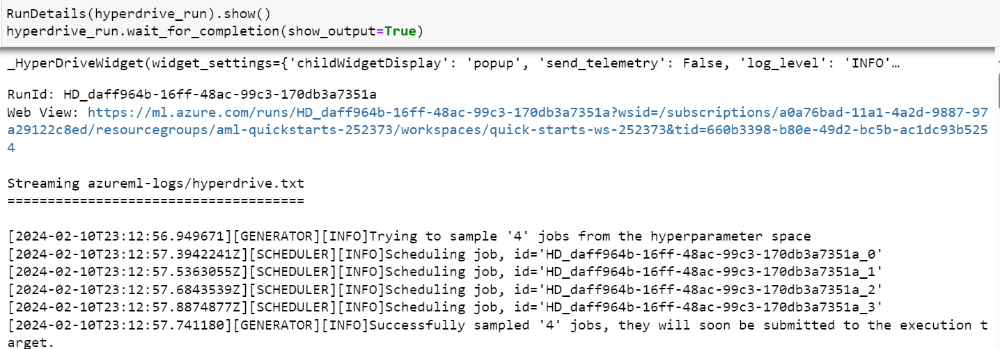
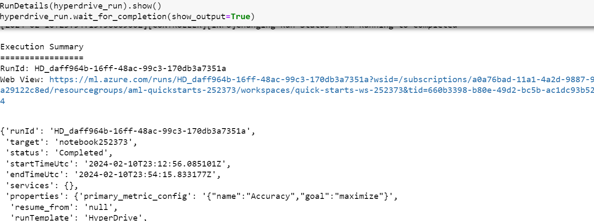
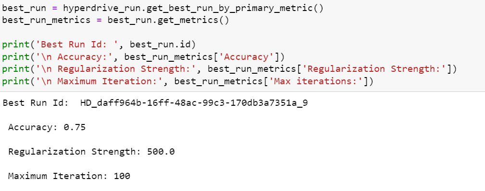
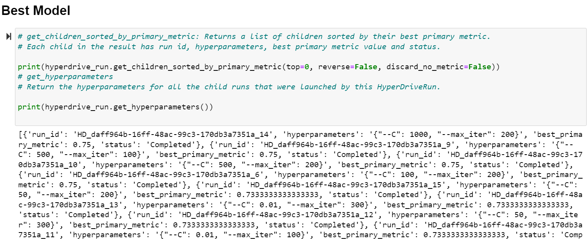
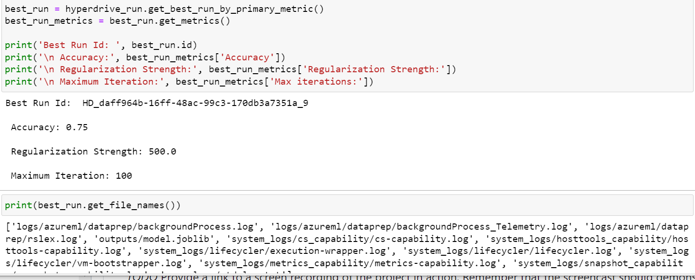
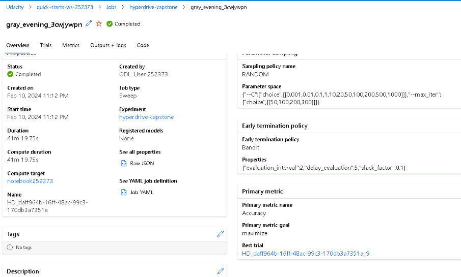

## Model Deployment

To deploy a model using Azure SDK, follow these steps:

1. Register the models of hyperdrive and AutoML using the SDK.
2. Identify the best model based on accuracy.
3. Choose either the environment of the best_run from AutoML or create a custom environment.
4. Utilize the score.py file generated during model training for deployment and evaluation. This script outlines the input data accepted by the model endpoint.
5. Deploy the model using any of the deployment choices - ACI, AKS, or local. For our project, deploy the model as a web service using Azure Container Instance with cpu_cores = 1, memory_gb = 1, and application insights enabled.
6. For inferencing, pass the sample test data in JSON format to the model endpoint to test the web service. The score.py file will process this data to make a successful REST API call.

**Models After Registration**

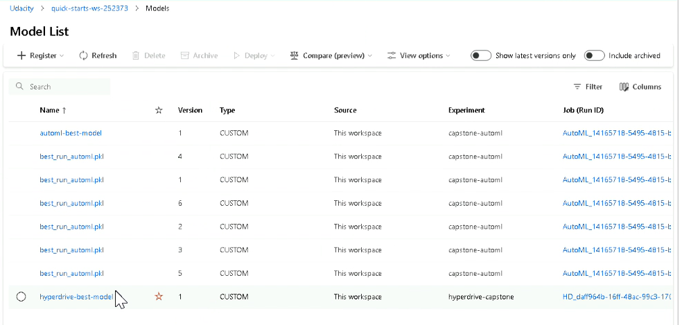

**Model After Deployment**

Successful model deployment was achieved using ACI (Azure Container Instance) with Application Insights enabled.

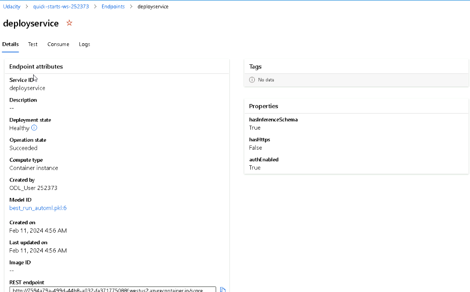

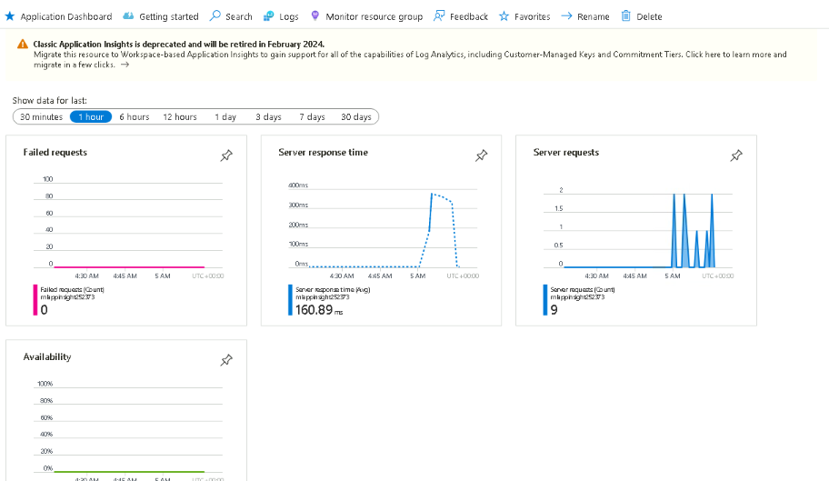

**Sample Data Consumption**

```python
data = {"data":
        [
          {
           "age": 60, 
           "anaemia": 0, 
           "creatinine_phosphokinase": 59, 
           "diabetes": 0, 
           "ejection_fraction": 25, 
           "high_blood_pressure": 1, 
           "platelets": 212000, 
           "serum_creatinine": 3.5, 
           "serum_sodium": 136, 
           "sex": 1, 
           "smoking": 1,
           "time": 187
          },
          {
           "age": 51, 
           "anaemia": 0, 
           "creatinine_phosphokinase": 1380, 
           "diabetes": 0, 
           "ejection_fraction": 25, 
           "high_blood_pressure": 1, 
           "platelets": 271000, 
           "serum_creatinine": 0.9, 
           "serum_sodium": 130, 
           "sex": 1, 
           "smoking": 0,
           "time": 38
          },
      ]
    }
```
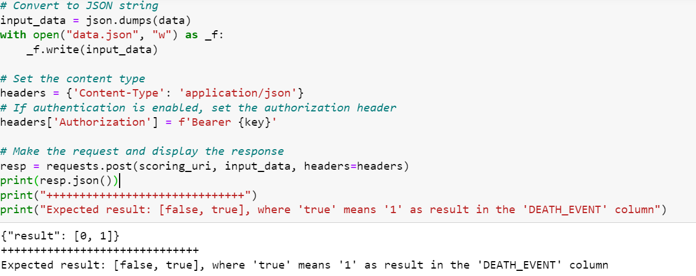

## Screen Recording

Here is the [screencast](https://www.dropbox.com/scl/fi/quaayt1qijidu4iuuur0s/Capstone-Project-Azure-Machine-Learning-Engineer-Google-Chrome-2024-02-10-23-36-51.mp4?rlkey=umxtxkp4wwmn2pqhjwwv2hhxl&dl=0) that demonstrates the functionality of the working deployed model with endpoint consumption. 


## Future Improvements

In the corresponding sections, future improvements for both AutoML and HyperDrive have been highlighted. Regarding the dataset, a recommendation is made to increase the sample size as 299 rows of data are deemed significantly small. Additionally, consideration is given to implementing advanced feature engineering techniques
