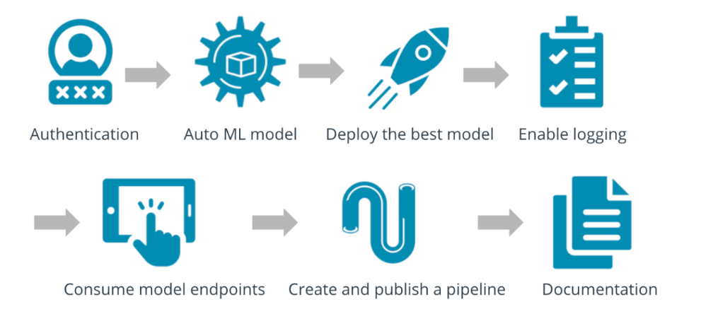

# MLOps: Orchestrating Machine Learning Operations
## Overview
In this project's context, an AutoML run was executed on the [Bank Marketing](https://automlsamplenotebookdata.blob.core.windows.net/automl-sample-notebook-data/bankmarketing_train.csv) Dataset. The top-performing model obtained from the AutoML process was deployed as a RESTful API Webservice. Endpoints were utilized to interact with the deployed model in Microsoft Azure Machine Learning Studio. Lastly, pipeline automation was employed to enhance machine learning operations. 

## Architectural Diagram
This diagram visually summarizes the workflow of this project.

**Image Courtesy: Nanodegree course for machine learning operation using MS Azure**

**Authentication**: This step aims to create a Service Principal for workspace access. However, due to restricted privileges in the Udacity-provisioned AML lab environment, it couldn't be executed in this project.

**Auto ML Model**: The objective is to leverage AutoML for training and ranking classification models based on AUC-weighted accuracy, aiding in identifying the most effective model for deployment.

**Deploying the Best Model**: This step involves selecting and deploying the top-performing model, establishing an endpoint for interaction to enable its utilization.

**Enabling Logging**: The goal here is to activate Application Insights to gather operational health logs from the deployed model's endpoint, enabling ongoing monitoring.

**Consuming Model Endpoints**: This step executes a script to interact with the deployed model's endpoint, testing its functionality, and saving data for benchmarking purposes.

**Pipeline Creation and Publishing**: This step creates an automated pipeline endpoint for AutoML training, streamlining and improving the efficiency of model training processes.

**Documentation**: This step provides a comprehensive screencast illustrating the ML application's operation and generates a detailed README.md to describe and document the project's essential steps.

## Key Steps
*TODO*: Write a short discription of the key steps. Remeber to include all the screenshots required to demonstrate key steps. 

## Screen Recording
*TODO* Provide a link to a screen recording of the project in action. Remember that the screencast should demonstrate:

## Standout Suggestions
*TODO (Optional):* This is where you can provide information about any standout suggestions that you have attempted.

