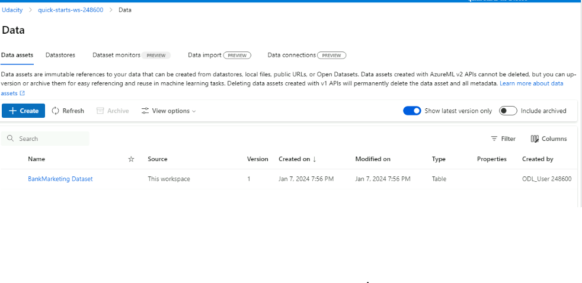
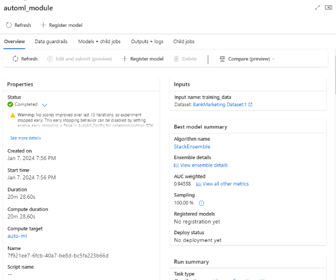
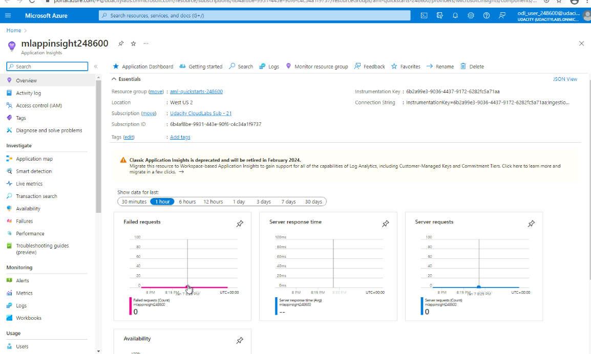
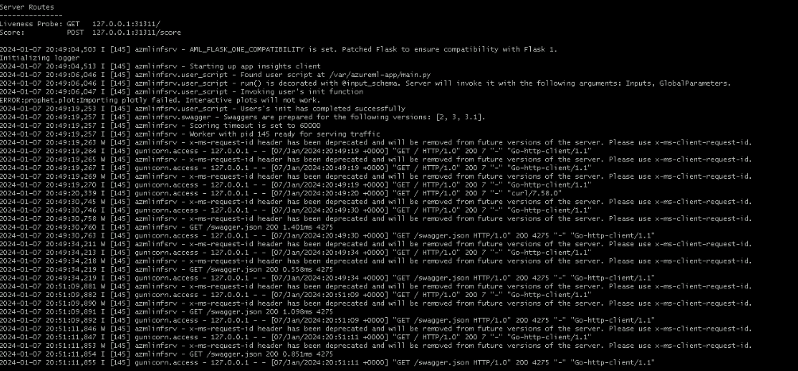
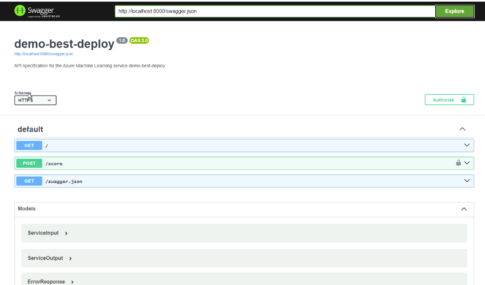

# MLOps: Orchestrating Machine Learning Operations
## Overview
In this project's context, an AutoML run was executed on the [Bank Marketing](https://automlsamplenotebookdata.blob.core.windows.net/automl-sample-notebook-data/bankmarketing_train.csv) Dataset. The top-performing model obtained from the AutoML process was deployed as a RESTful API Webservice. Endpoints were utilized to interact with the deployed model in Microsoft Azure Machine Learning Studio. Lastly, pipeline automation was employed to enhance machine learning operations. 

## Architectural Diagram
This diagram visually summarizes the workflow of this project.


**Image Courtesy: [Nanodegree course for machine learning operation using MS Azure](https://www.udacity.com/course/machine-learning-engineer-for-microsoft-azure-nanodegree--nd00333?coupon=BLACKFRIDAY50&utm_source=gsem_brand&utm_source=gsem_brand&utm_medium=ads_r&utm_medium=ads_r&utm_campaign=19692269004_c_individuals&utm_campaign=19692269004_c_individuals&utm_term=151372117852&utm_term=151372117852&utm_keyword=udacity%20azure%20machine%20learning_e&utm_keyword=udacity%20azure%20machine%20learning_e&gad_source=1&gclid=EAIaIQobChMI5evHq_PQgwMVsptaBR2tgAJLEAAYASAAEgLGg_D_BwE)**

**1. Authentication**: This step aims to create a Service Principal for workspace access. However, due to restricted privileges in the Udacity-provisioned AML lab environment, it couldn't be executed in this project.

**2. Auto ML Model**: The objective is to leverage AutoML for training and ranking classification models based on AUC-weighted accuracy, aiding in identifying the most effective model for deployment.

**3. Deploying the Best Model**: This step involves selecting and deploying the top-performing model and establishing an endpoint for interaction to enable its utilization.

**4. Enabling Logging**: The goal here is to activate Application Insights to gather operational health logs from the deployed model's endpoint, enabling ongoing monitoring.

**5. Consuming Model Endpoints**: This step executes a script to interact with the deployed model's endpoint, testing its functionality, and saving data for benchmarking purposes.

**6. Pipeline Creation and Publishing**: This step creates an automated pipeline endpoint for AutoML training, streamlining and improving the efficiency of model training processes.

**7. Documentation**: This step provides a comprehensive screencast illustrating the ML application's operation and generates a detailed README.md to describe and document the project's essential steps.


## Key Steps
The workflow can be decomposed into the following pivotal steps:

**1. Dataset Registration**: 
The following code snippet and screenshot show how the workflow registers the  [Bank Marketing](https://automlsamplenotebookdata.blob.core.windows.net/automl-sample-notebook-data/bankmarketing_train.csv) dataset in the Azure ML studio.
```python
found = False
key = "BankMarketing Dataset"
description_text = "Bank Marketing DataSet for Udacity Course 2"

if key in ws.datasets.keys(): 
        found = True
        dataset = ws.datasets[key] 

if not found:
        # Create AML Dataset and register it into Workspace
        example_data = 'https://automlsamplenotebookdata.blob.core.windows.net/automl-sample-notebook-data/bankmarketing_train.csv'
        dataset = Dataset.Tabular.from_delimited_files(example_data)        
        #Register Dataset in Workspace
        dataset = dataset.register(workspace=ws,
                                   name=key,
                                   description=description_text)
```


**2. Automated ML Experiment**  
In this project, the following configuration of AutoML has been used:
```python
from azureml.pipeline.core import PipelineData, TrainingOutput

ds = ws.get_default_datastore()
metrics_output_name = 'metrics_output'
best_model_output_name = 'best_model_output'

metrics_data = PipelineData(name='metrics_data',
                           datastore=ds,
                           pipeline_output_name=metrics_output_name,
                           training_output=TrainingOutput(type='Metrics'))
model_data = PipelineData(name='model_data',
                           datastore=ds,
                           pipeline_output_name=best_model_output_name,
                           training_output=TrainingOutput(type='Model'))
```
Once the AutoML steps are executed, the experiment undergoes training and testing using the provided data within the AutoML environment to derive the best model. Below are the accompanying screenshots:


**Screenshot of job completion** 



**Screenshot of the Best Model** 

**3. Deployment of the Best Model and Enable Logging** 

The deployment involves utilizing the Best Model to interact with the HTTP API service. This interaction is established by transmitting data through POST requests to the model. Once the Best Model is deployed, the process involves using Application Insights to enable log retrieval. These logs are showcased in the following snapshots:


**Enabling the Application Insights**



**Status of the Application Insights Dashboard**



**Enabling and Capturing the logs**

**4. Consume model using Swagger**

During this step, the deployed model was accessed using Swagger. Utilizing a swagger-based JSON file provided by Azure for deployed models, interactions were made. The snapshot below demonstrates the engagement with Swagger instances running for documenting the HTTP API associated with the model.



**Swagger instances running for the Documentation of the HTTP API associated with the best model**

**Endpoint Consumption** 

During this step, the endpoint.py script was executed by updating the scoring_uri and the key to align with the service's key and the URI generated post the deployment of the best model.


**Screenshot of executing endpoint.py**

**5. Benchmarking**

In this step, the deployed model was load-tested with Apache Benchmark (ab) runs against the HTTP API using the authentication keys to retrieve performance results. Following screenshot captures such benchmarking process


**Screenshot of the outcome of the benchmarking process**


**6. Pipeline creation and monitoring** 

This code excerpt demonstrates how the training pipeline was created and ran :
```python
from azureml.pipeline.core import Pipeline
pipeline = Pipeline(
    description="pipeline_with_automlstep",
    workspace=ws,    
    steps=[automl_step])
pipeline_run = experiment.submit(pipeline)
```

After creating the pipeline following code snippet is used for monitoring the pipeline status:

```python
from azureml.widgets import RunDetails
RunDetails(pipeline_run).show()
pipeline_run.wait_for_completion()
```


**Screenshot of Pipeline run status**


**Screenshot of Pipeline run completion**

**7. Publish and consumption of the Pipeline**

After creating the pipelines are published in the AzureML studio. The below screenshots verify that:

 

**Screenshot of endpoint pipeline before running**

 

**Screenshot of the pipeline before publishing**

 

**Screenshot of the pipeline after publishing and consuming**


## Screen Recording

[Video Link](https://www.dropbox.com/scl/fi/d50u78sq2cwjutnj9ttmc/Project_-Operationalizing-Machine-Learning.mp4?rlkey=y7rwyrgghj4p973zxzv8fml71&dl=0)


## Suggestions for future improvements

**1.** Broaden the exploration of AutoML model interpretability, extending its application to encompass more intricate and expansive datasets. This extension aims to not only accelerate the process but also extract deeper insights crucial for refining feature engineering practices. These refined practices, in turn, play a pivotal role in enhancing the accuracy of complex models, thereby enriching the overall predictive capacity.

**2.** Integrate a comprehensive CI/CD pipeline that seamlessly interacts with the Published Pipeline, facilitating the initiation of AutoML training runs at predefined intervals or as needed on an ad-hoc basis. This incorporation of continuous integration and continuous deployment streamlines the entire training process, promoting efficiency and ensuring the models stay updated with the latest data trends and patterns.

**3.*** Furthermore, leveraging the knowledge and proficiency gained from these implementations, consider expanding the scope to create and deploy various other pipeline types. Embrace the creation and publication of pipelines dedicated to Data Preparation, adept Validation procedures, efficient Deployment strategies, and amalgamated tasks that synergize these crucial aspects. This diversified approach not only enhances the overall workflow but also fortifies the project's adaptability to diverse scenarios and requirements, establishing a robust foundation for comprehensive model development and deployment.


